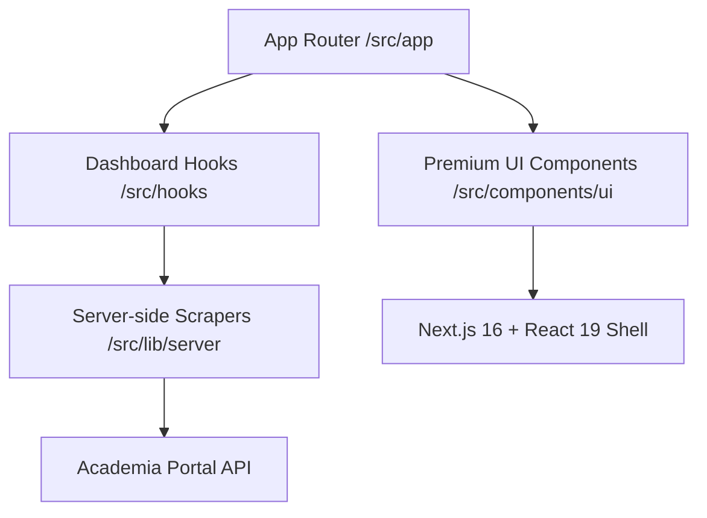

# FcuK Academia
### Academia Redefined. Premium. Personal. Mobile-First.

**FcuK Academia** is an unofficial, high-performance web dashboard for the **SRMIST Academia Portal**. Built with the cutting-edge **Next.js 16 (React 19)** and **Tailwind CSS 4**, it transforms the clunky academic experience into a sleek, modern, and information-dense dashboard that respects your time.

---

## ⚡ Core Capabilities

- **🧠 Smart Timetable**: Automatically tracks the **Day Order** and shows your current class, next class, or upcoming schedule with pinpoint accuracy.
- **📈 Attendance Recovery System**: Instantly see your overall attendance and know exactly when you're in **'Safe'** or **'Recovery'** mode (75% threshold).
- **📝 Real-time Marks**: Live internal mark totals and **'Academic Alerts'** for subjects that need your immediate attention.
- **🗓️ Integrated Planner**: Check your monthly calendar, university events, and day order mapping in one unified view.
- **✨ Premium UI**: 
    - **Micro-animations**: Powered by **Framer Motion** and **Lottie**.
    - **Visual Cues**: Count-up numbers, text-typing effects, and glassmorphism cards.
    - **Dark/Luxury Theme**: Designed for the modern student aesthetic.
- **🔒 Secure Access**: Full support for Zoho Creator Auth, concurrent session management, and **CAPTCHA** handling.

---

## 🛠️ The Modern Tech Stack

- **Framework**: `Next.js 16 (App Router)` & `React 19`
- **Styling**: `Tailwind CSS 4` (High Performance), `Framer Motion` (Animations)
- **Intelligence**: `Axios` + `Cheerio` (Custom HTML Scrapers)
- **Visuals**: `Lucide-React` (Icons), `Recharts` (Analytics), `Lottie-React` (Motion Art)
- **State**: `React Context` with a custom `Dashboard` hook architecture.

---

## 🚀 Getting Started

### Prerequisites

- **Node.js**: `v20.9.0` or higher
- **Academia Credentials**: Required for live data extraction.

### Installation

1. Clone the repository:
   ```bash
   git clone https://github.com/yourusername/fcuk-app.git
   cd fcuk-app
   ```

2. Install dependencies:
   ```bash
   npm install
   ```

3. Run the development server:
   ```bash
   npm run dev
   ```

4. Open [http://localhost:3000](http://localhost:3000) with your browser.

---

## 🏗️ Project Architecture



- **`src/lib/server/academia.ts`**: The core "brain" that parses the Academia portal and manages secure sessions.
- **`src/app/page.tsx`**: The main dashboard page with dynamic scheduling logic.
- **`src/components/ui`**: A collection of high-end, reusable components like `GlowCard`, `GlassCard`, and `TextType`.
- **`src/hooks/useDashboard.ts`**: A robust hook that provides real-time access to the user's academic state.

---

## ⚖️ Disclaimer & Privacy

**Disclaimer**: This is an **unofficial** third-party application and is **not** endorsed by, affiliated with, or maintained by **SRM Institute of Science and Technology (SRMIST)**. Use this application responsibly.

**Privacy**: All data is retrieved directly from the Academia portal. We do **not** store your credentials or personal academic data on any external servers. This is a client-side focused dashboard for personal academic management.

---

### *Study. Survive. Repeat.*
Designed with ❤️ for the student community.


*FCUK stands for Fully Controlled University Kit

